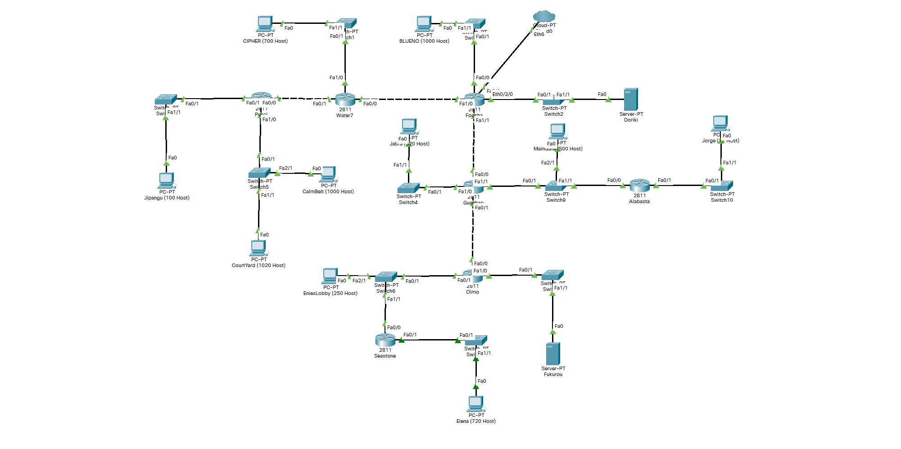

# Jarkom-Modul-4-C13-2021

## Anggota Kelompok :

| Anggota              | NRP            |
| -------------------- | -------------- |
| M. Auliya Mirzaq R.  | 05111940000065 |
| M. Akmal Joedhiawan  | 05111940000125 |
| M. Arsyad Ardiansyah | 05111940000228 |

## Soal

Dengan menggunakan topologi jaringan di atas akan dilakukan perhitungan subnet dengan menggunakan 2 buah metode, yaitu VLSM (Variable Length Subnet Masking) dan CIDR (Classless Inter Domain Routing)
