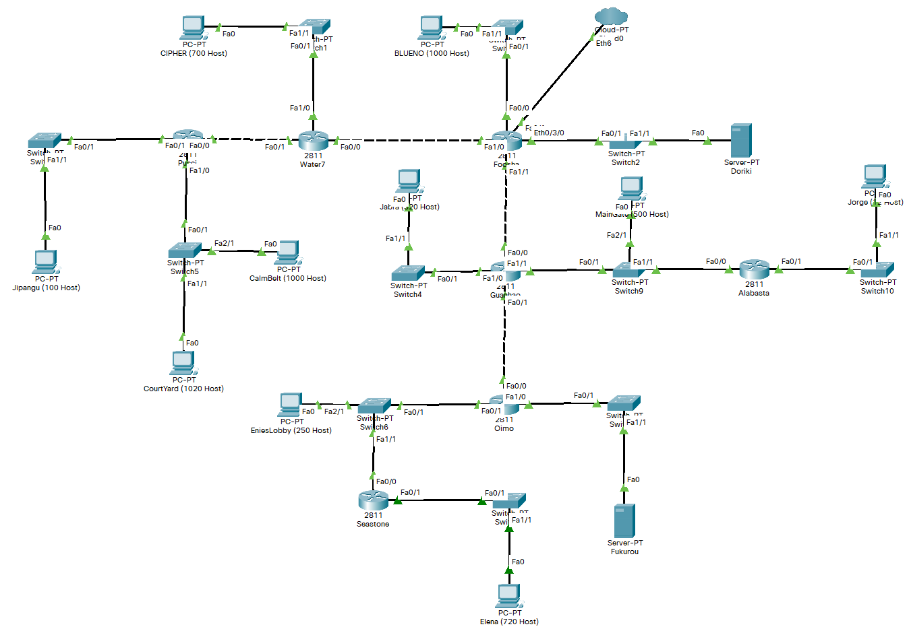
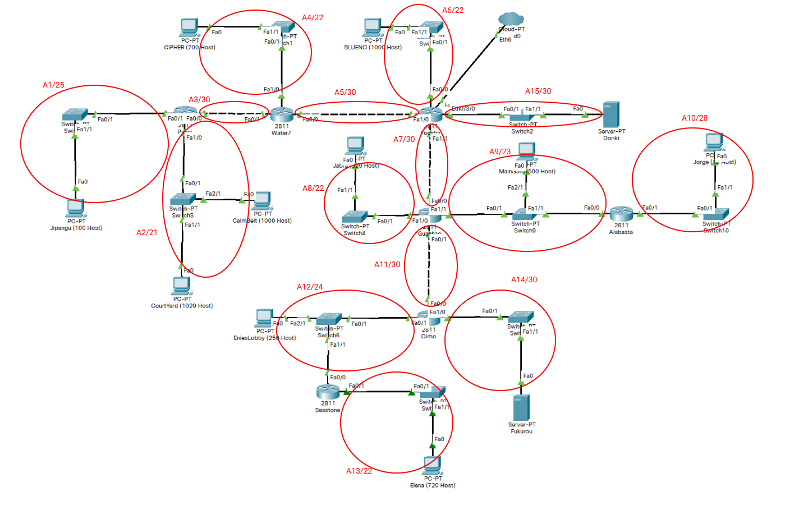
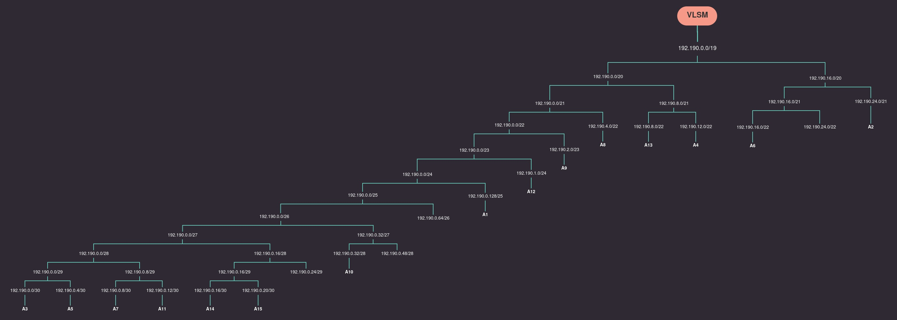
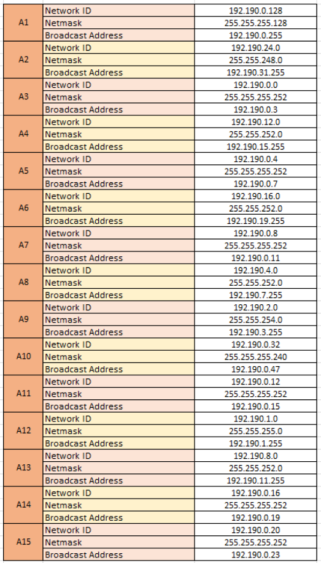
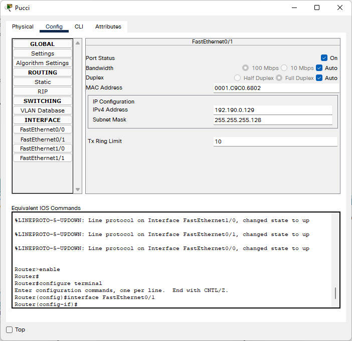
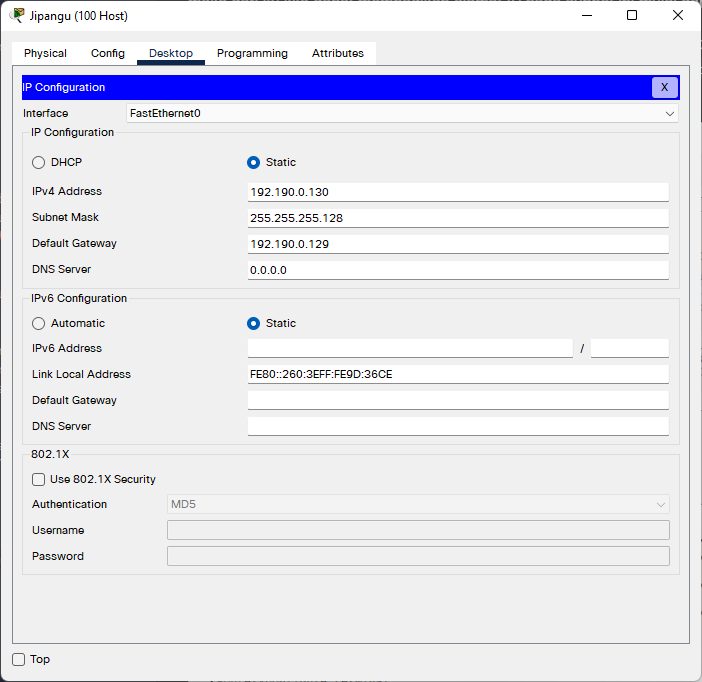
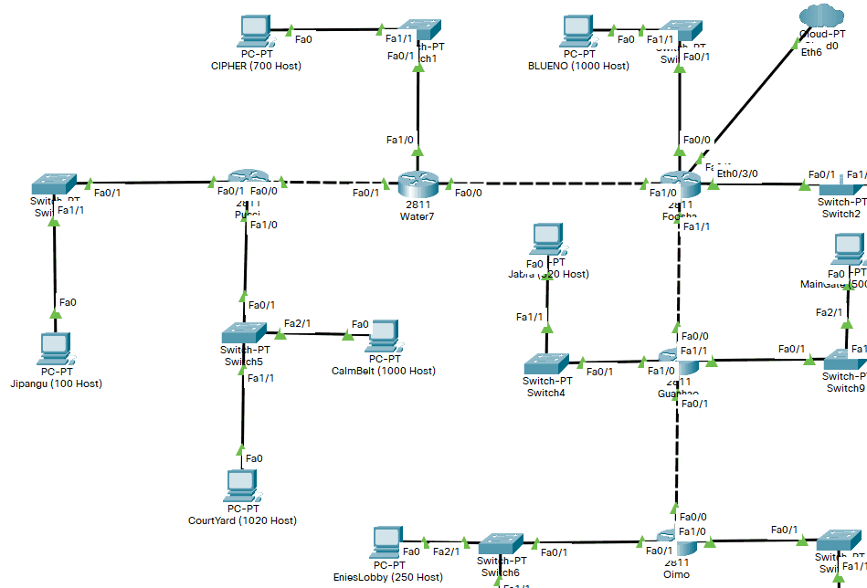
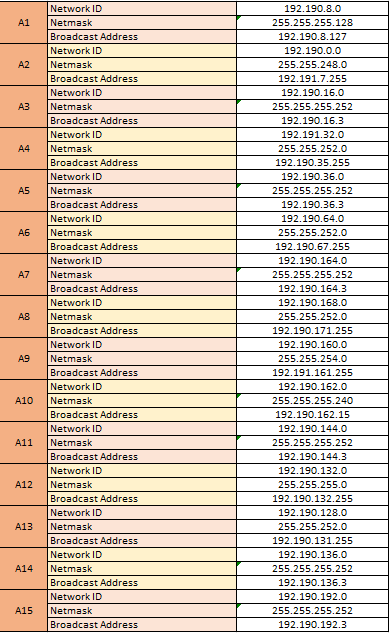

# Jarkom-Modul-4-C13-2021

## Anggota Kelompok :

| Anggota              | NRP            |
| -------------------- | -------------- |
| M. Auliya Mirzaq R.  | 05111940000065 |
| M. Akmal Joedhiawan  | 05111940000125 |
| M. Arsyad Ardiansyah | 05111940000228 |

## Soal



Dengan menggunakan topologi jaringan di atas akan dilakukan perhitungan subnet dengan menggunakan 2 buah metode, yaitu VLSM (Variable Length Subnet Masking) dan CIDR (Classless Inter Domain Routing)

## CPT - VLSM

### Pembagian IP

Untuk pembagian subnet nya akan dibagi seperti gambar berikut :



Kemudian dengan pembagian subnet sesuai gambar tersebut, akan dilakukan penghitungan kebutuhan IP untuk tiap subnet nya. Hasilnya dapat dilihat pada tabel di bawah :

| Subnet    | Jumlah IP | Netmask |
| --------- | --------- | ------- |
| A1        | 101       | /25     |
| A2        | 2021      | /21     |
| A3        | 2         | /30     |
| A4        | 701       | /22     |
| A5        | 2         | /30     |
| A6        | 1001      | /22     |
| A7        | 2         | /30     |
| A8        | 521       | /22     |
| A9        | 502       | /23     |
| A10       | 13        | /28     |
| A11       | 2         | /30     |
| A12       | 252       | /24     |
| A13       | 721       | /22     |
| A14       | 2         | /30     |
| A15       | 2         | /30     |
| **TOTAL** | **5845**  | **/19** |

Berdasarkan total IP dan netmask yang dibutuhkan, maka kita dapat menggunakan netmask **/19** untuk memberikan pengalamatan pada subnet.

Setelah menghitung total IP yang dibutuhkan, subnet paling besar yang dibentuk memiliki NID **192.190.0.0** dan netmask **/19**. Dengan menggunakan NID dan netmask tersebut kita dapat menghitung pembagian alamat IP untuk tiap subnet pada gambar pohon pengalamatan dibawah.



Untuk dapat melihat lebih jelas pohon pengalamatannya, dapat juga diakses menggunakan link berikut: https://gitmind.com/app/doc/4ee6169070

Dari pohonn tersebut akan mendapat pembagian alamt IP untuk setiap subnet sebagai berikut:



### Routing

Setelah melakukan penghitungan untuk pembagian alamat IP untuk tiap subnet. Selanjutnya kita akan melakukan routing pada topologi tersebut. Routing ini bertujuan agar tiap subnet dapat terhubung ke subnet lain dan juga agar bisa bertukar _packet_ antar subnetnya.

#### Mengatur IP setiap subnet

Pertama, masukkan alamat IP yang sudah dihitung sebelumnya ke setiap subnet dalam topologi.

Misalnya untuk mengatur alamt IP untuk subnet `A1`, pada subnet ini terdapat 2 _device_ yang perlu diatur yaitu `Router Pucci` dan `Client Jipangu`. Untuk subnet A1 memiliki NID `192.190.0.128`, maka dari itu kita dapat membagikan alamat IP pada subnet ini mulai dari `192.190.0.129`.

Untuk Router Pucci terhubung ke subnet A1 melalui interface `Fa0/1`. Jadi kita akan atur pada interface tersebut. Kita akan memberi IP pada `192.190.0.129` pada `Router Pucci` untuk interdace `Fa0/1`.



Sedangkan untuk client `jipangu`, kita akan memberi IP `192.190.0.130`. Jangan lupa untuk mengisi Default Gateway nya dengan alamat milik router, yaitu `192.190.0.129`



Itu contoh mengatur IP untuk subnet `A1`. Untuk subnet yang lain menggunakan cara yang sama, hanya tinggal menyesuaikan range ip dan netmask nya.

Jika pembagian IP nya diringkas maka akan menjadi seperi ini :

```
//====A1===//
PUCCI Fa0/1
IP      : 192.190.0.129
Netmask : 255.255.255.128

JIPANGU Fa0
IP      : 192.190.0.130
Netmask : 255.255.255.128
Default Gateway : 192.190.0.129

//====A2===//
PUCCI Fa1/0
IP      : 192.190.24.1
Netmask : 255.255.248.0

COURTYARD Fa0
IP      : 192.190.24.3
Netmask : 255.255.248.0
Default Gateway : 192.190.24.1

CALMBELT Fa0
IP      : 192.190.24.2
Netmask : 255.255.248.0
Default Gateway : 192.190.24.1

//====A3===//
PUCCI Fa0/1
IP      : 192.190.0.2
Netmask : 255.255.255.252

WATER7 Fa0/1
IP      : 192.190.0.1
Netmask : 255.255.255.252

//====A4===//
WATER7 Fa1/0
IP      : 192.190.12.1
Netmask : 255.255.252.0

CHIPER Fa0
IP      : 192.190.12.2
Netmask : 255.255.252.0
Default Gateway : 192.190.12.1

//====A5===//
WATER7 Fa0/0
IP      : 192.190.0.6
Netmask : 255.255.255.252

FOOSHA Fa1/0
IP      : 192.190.0.5
Netmask : 255.255.255.252

//====A6===//
FOOSHA Fa0/0
IP      : 192.190.16.1
Netmask : 255.255.252.0

BLUENO Fa0
IP      : 192.190.16.2
Netmask : 255.255.252.0
Default Gateway : 192.190.16.1

//====A7===//
FOOSHA Fa1/1
IP      : 192.190.0.9
Netmask : 255.255.255.252

GUANHAO Fa0/0
IP      : 192.190.0.10
Netmask : 255.255.255.252

//====A8===//
GUANHAO Fa1/0
IP      : 192.190.4.1
Netmask : 255.255.252.0

JABRA Fa0
IP      : 192.190.4.2
Netmask : 255.255.252.0
Default Gateway : 192.190.4.1

//====A9===//
GUANHAO Fa1/1
IP      : 192.190.2.1
Netmask : 255.255.254.0

MAINGATE Fa0
IP      : 192.190.2.2
Netmask : 255.255.254.0
Default Gateway : 192.190.2.1

ALABASTA Fa0/0
IP      : 192.190.2.3
Netmask : 255.255.254.0

//====A10===//
ALABASTA Fa0/1
IP      : 192.190.0.33
Netmask : 255.255.255.240

JORGE Fa0
IP      : 192.190.0.34
Netmask : 255.255.255.240
Default Gateway : 192.190.0.33

//====A11===//
GUANHAO Fa0/1
IP      : 192.190.0.13
Netmask : 255.255.255.252

OIMO Fa0/0
IP      : 192.190.0.14
Netmask : 255.255.255.252

//====A12===//
OIMO Fa0/1
IP      : 192.190.1.1
Netmask : 255.255.255.0

ENIESLOBBY Fa0
IP      : 192.190.1.2
Netmask : 255.255.255.0
Default Gateway : 192.190.1.1

SEASTONE Fa0/0
IP      : 192.190.1.3
Netmask : 255.255.255.0

//====A13===//
SEASTONE Fa0/1
IP      : 192.190.8.1
Netmask : 255.255.252.0

ELENA Fa0
IP      : 192.190.8.2
Netmask : 255.255.252.0
Default Gateway : 192.190.8.1

//====A14===//
OIMO Fa1/0
IP      : 192.190.0.17
Netmask : 255.255.255.252

FUKUROU Fa0
IP      : 192.190.0.18
Netmask : 255.255.255.252
Default Gateway : 192.190.0.17

//====A15===//
FOOSHA Eth0/3/0
IP      : 192.190.0.21
Netmask : 255.255.255.252

DORIKI Fa0
IP      : 192.190.0.22
Netmask : 255.255.255.252
Default Gateway : 192.190.0.21
```

#### Pengaturan Router

Jika sudah sekarang untuk mengatur jalur atau rute nya untuk dapat mengirimkan paket ke semua subnet dalam topologi. Perangkat yang diatur adalah Routernya. Metode routing yang dipakai adalah static routing.

Pengaturan routing ada pada menu `config->Routing->static`

Untuk router utama yaitu `Foosha` cara mengaturnya adalah dengan menambahkan routing untuk semua subnet selain yang berhubungan langsung dengan router tersebut. Maka akan menambahkan route untuk semua subnet kecuali untuk A5, A6, A7, dan A15.

Untuk router yang lain (di bawah router utama) hanya meneruskan sambungan agar mencapai router utama.

Berikut ringkasan untuk pengaturan routingnya

- **Foosha**
  ```
    192.190.12.0/22 via 192.190.0.6
    192.190.0.0/30 via 192.190.0.6
    192.190.24.0/21 via 192.190.0.6
    192.190.0.128/25 via 192.190.0.6
    192.190.4.0/22 via 192.190.0.10
    192.190.2.0/23 via 192.190.0.10
    192.190.0.12/30 via 192.190.0.10
    192.190.0.32/28 via 192.190.0.10
    192.190.0.16/30 via 192.190.0.10
    192.190.1.0/24 via 192.190.0.10
    192.190.8.0/22 via 192.190.0.10
  ```
- **Water 7**
  ```
    0.0.0.0/0 via 192.190.0.5
    192.190.0.128/25 via 192.190.0.2
    192.190.24.0/21 via 192.190.0.2
  ```
- **Pucci**
  ```
    0.0.0.0/0 via 192.190.0.1
  ```
- **Guanhao**
  ```
    0.0.0.0/0 via 192.190.0.9
    192.190.0.32/28 via 192.190.2.3
    192.190.0.16/30 via 192.190.0.14
    192.190.1.0/24 via 192.190.0.14
    192.190.8.0/22 via 192.190.0.14
  ```
- **Alabasta**
  ```
    0.0.0.0/0 via 192.190.2.1
  ```
- **Oimo**
  ```
    0.0.0.0/0 via 192.190.0.13
    192.190.8.0/22 via 192.190.1.3
  ```
- **Seastone**
  ```
    0.0.0.0/0 via 192.190.1.1
  ```

Jika sudah menambahkan pengaturan untuk setiap router, kita bisa mencoba untuk mengirim paket untuk mengetesnya. Untuk testing kita akan mencoba untuk mengirim paket dari `Client Chiper` ke `Client Courtyard`. Percobaanya dapat dilihat dibawah ini.



## GNS3 - CIDR

### Penggabungan Subnet

Penggabungan subnet dilakukan dengan menggabungkan subnet yang letaknya paling jauh dari cloud terlebih dahulu seperti gambar dibawah ini:


Setelah itu membuat Tree CIDR yang dapat dilihat pada gambar dibawah atau di link berikut : https://gitmind.com/app/doc/2fc6169364


Dilakukan perhitungan Network ID dan Broadcast Address, didapatkan :



### Topologi


Pada semua node selain router FOOSHA tambahkan `echo nameserver 192.168.122.1 > /etc/resolv.conf` sebagai ip milik foosha

### Konfigurasi IP

#### Router

Pada semua router lakukan perubahan dalam file `vim /etc/sysctl.conf` uncomment perintah `net.ipv4.ip_forward=1`

- **FOOSHA**
```
auto lo
iface lo inet loopback

auto eth0
iface eth0 inet dhcp

#A5
auto eth1
iface eth1 inet static
	address 192.190.36.1
	netmask 255.255.255.252

#A6
auto eth2
iface eth2 inet static
	address 192.190.64.1
	netmask 255.255.252.0

#A7
auto eth3
iface eth3 inet static
	address 192.190.164.1
	netmask 255.255.255.252

#A15
auto eth4
iface eth4 inet static
	address 192.190.192.1
	netmask 255.255.252.252
```

- **WATER7**
```
auto lo
iface lo inet loopback

#A5
auto eth0
iface eth0 inet static
	address 192.190.36.2
	netmask 255.255.255.252
        gateway 192.190.36.1

#A3
auto eth1
iface eth1 inet static
	address 192.190.16.1
	netmask 255.255.255.252

#A4
auto eth2
iface eth2 inet static
	address 192.190.32.1
	netmask 255.255.252.0

```

- **PUCCI**
```
auto lo
iface lo inet loopback

#A3
auto eth0
iface eth0 inet static
	address 192.190.16.2
	netmask 255.255.255.252
        gateway 192.190.16.1

#A1
auto eth1
iface eth1 inet static
	address 192.190.8.1
	netmask 255.255.255.128

#A2
auto eth2
iface eth2 inet static
	address 192.190.0.1
	netmask 255.255.248.0
```

- **GUANHAO**
```
auto lo
iface lo inet loopback

#A7
auto eth0
iface eth0 inet static
        address 192.190.164.2
	netmask 255.255.255.252
        gateway 192.190.164.1

#A11
auto eth1
iface eth1 inet static
	address 192.190.144.1
	netmask 255.255.255.252

#A8
auto eth2
iface eth2 inet static
	address 192.190.168.1
	netmask 255.255.252.0

#A9
auto eth3
iface eth3 inet static
	address 192.190.160.1
	netmask 255.255.254.0

```

- **OIMO**
```
auto lo
iface lo inet loopback

#A11
auto eth0
iface eth0 inet static
	address 192.190.144.2
	netmask 255.255.255.252
        gateway 192.190.144.1

#A12
auto eth1
iface eth1 inet static
	address 192.190.132.1
	netmask 255.255.255.0

#A14
auto eth2
iface eth2 inet static
	address 192.190.136.1
	netmask 255.255.255.252
```

- **ALABASTA**
```
auto lo
iface lo inet loopback

#A9
auto eth0
iface eth0 inet static
	address 192.190.160.3
	netmask 255.255.254.0
        gateway 192.190.160.1

#A10
auto eth1
iface eth1 inet static
	address 192.190.162.1
	netmask 255.255.255.240
```

- **SEASTONE**
```
auto lo
iface lo inet loopback

auto eth0
iface eth0 inet static
	address 192.190.132.3
	netmask 255.255.255.0
        gateway 192.190.132.1

#A11
auto eth1
iface eth1 inet static
	address 192.190.128.1
	netmask 255.255.252.0
```

#### Server

- **DORIKI**
```
auto eth0
iface eth0 inet static
	address 192.190.192.2
	netmask 255.255.255.252
	gateway 192.190.192.1
```

- **FUKUROU**
```
auto eth0
iface eth0 inet static
	address 192.190.136.2
	netmask 255.255.255.252
	gateway 192.190.136.1
```

#### Klien

- **JIPANGU**
```
auto eth0
iface eth0 inet static
	address 192.190.8.2
	netmask 255.255.255.128
	gateway 192.190.8.1
```

- **CYPHER**
```
auto eth0
iface eth0 inet static
	address 192.190.32.2
	netmask 255.255.252.0
	gateway 192.190.32.1
```

- **COURTYARD**
```
auto eth0
iface eth0 inet static
	address 192.190.0.2
	netmask 255.255.248.0
	gateway 192.190.0.1
```

- **CALMBELT**
```
auto eth0
iface eth0 inet static
	address 192.190.0.3
	netmask 255.255.248.0
	gateway 192.190.0.1
```

- **BLUENO**
```
auto eth0
iface eth0 inet static
	address 192.190.64.2
	netmask 255.255.252.0
	gateway 192.190.64.1
```

- **JABRA**
```
auto eth0
iface eth0 inet static
	address 192.190.168.2
	netmask 255.255.252.0
	gateway 192.190.168.1
```

- **MAINGATE**
```
auto eth0
iface eth0 inet static
	address 192.190.160.2
	netmask 255.255.254.0
	gateway 192.190.160.1
```

- **JORGE**
```
auto eth0
iface eth0 inet static
	address 192.190.162.2
	netmask 255.255.255.240
	gateway 192.190.162.1
```

- **ENNIESLOBBY**
```
auto eth0
iface eth0 inet static
	address 192.190.132.2
	netmask 255.255.255.0
	gateway 192.190.132.1
```

- **ELENA**
```
auto eth0
iface eth0 inet static
	address 192.190.128.2
	netmask 255.255.252.0
	gateway 192.190.128.1
```

Pada router FOOSHA tambahkan perintah `iptables -t nat -A POSTROUTING -o eth0 -j MASQUERADE -s 192.190.0.0/16`

### Routing

Buat file dengan nama `route.sh` pada setiap router untuk mencegah routing hilang ketika gns3 direstart dan tambahkan command berikut

- **FOOSHA**
```
route add -net 192.190.8.0 netmask 255.255.255.128 gw 192.190.36.2
route add -net 192.190.0.0 netmask 255.255.248.0 gw 192.190.36.2
route add -net 192.190.16.0 netmask 255.255.255.252 gw 192.190.36.2
route add -net 192.190.32.0 netmask 255.255.252.0 gw 192.190.36.2
route add -net 192.190.168.0 netmask 255.255.252.0 gw 192.190.164.2
route add -net 192.190.160.0 netmask 255.255.254.0 gw 192.190.164.2
route add -net 192.190.162.0 netmask 255.255.255.240 gw 192.190.164.2
route add -net 192.190.144.0 netmask 255.255.255.252 gw 192.190.164.2
route add -net 192.190.132.0 netmask 255.255.255.0 gw 192.190.164.2
route add -net 192.190.128.0 netmask 255.255.252.0 gw 192.190.164.2
route add -net 192.190.136.0 netmask 255.255.255.252 gw 192.190.164.2
```

- **WATER7**
```
route add -net 0.0.0.0 netmask 0.0.0.0 gw 192.190.36.1
route add -net 192.190.8.0 netmask 255.255.255.128 gw 192.190.16.2
route add -net 192.190.0.0 netmask 255.255.248.0 gw 192.190.16.2
```

- **PUCCI**
```
route add -net 0.0.0.0 netmask 0.0.0.0 gw 192.190.16.1
```

- **GUANHAO**
```
route add -net 0.0.0.0 netmask 0.0.0.0 gw 192.190.164.1
route add -net 192.190.162.0 netmask 255.255.255.240 gw 192.190.160.3
route add -net 192.190.132.0 netmask 255.255.255.0 gw 192.190.144.2
route add -net 192.190.128.0 netmask 255.255.252.0 gw 192.190.144.2
route add -net 192.190.136.0 netmask 255.255.255.252 gw 192.190.144.2
```

- **ALABASTA**
```
route add -net 0.0.0.0 netmask 0.0.0.0 gw 192.190.160.1
```

- **OIMO**
```
route add -net 0.0.0.0 netmask 0.0.0.0 gw 192.190.144.1
route add -net 192.190.128.0 netmask 255.255.252.0 gw 192.190.132.3
```

- **SEASTONE**
```
route add -net 0.0.0.0 netmask 0.0.0.0 gw 192.190.132.1
```

### Hasil

- **Klien - my.its.ac.id


- **Klien ELENA - Klien CYPHER**


- **Klien JORGE - ROUTER PUCCI**


- **Klien ELENA - ROUTER FOOSHA**


- **Router SEASTONE - Router WATER7**


## KENDALA

- Pembagian IP pada CIDR dan pemberian routing pada awalnya kurang benar
